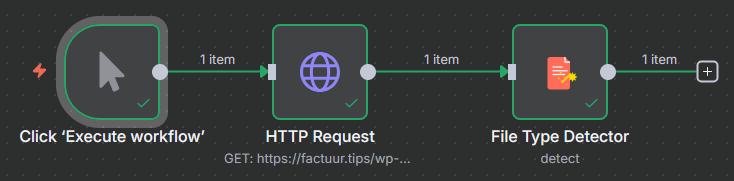

# Developing n8n-nodes-file-type-detector

This document provides a comprehensive guide for setting up your local development environment for the n8n-nodes-file-type-detector custom node.

## Prerequisites

Before you begin, ensure you have the following installed on your system:

### Required Software
- **Git:** For version control and cloning repositories, see [here](https://git-scm.com/downloads).
- **Node and NPM:** Required for developing the custom node module.
- **GitHub CLI:** Is a tool that brings GitHub's features (like issues, pull requests, releases, and more) directly to your terminal.
- **n8n:** Locale version of n8n to test with.

### Node Installation

Node version 20 is minimum version required by n8n. You can find instructions on how to install both using nvm (Node Version Manager) for Linux, Mac, and WSL [here](https://github.com/nvm-sh/nvm). For Windows users, refer to Microsoft's guide to [Install NodeJS on Windows](https://docs.microsoft.com/en-us/windows/dev-environment/javascript/nodejs-on-windows).

```bash
curl -fsSL https://deb.nodesource.com/setup_20.x | sudo -E bash -
node --version
```

### GitHub CLI Installation

Instead of switching to your web browser to interact with GitHub, you can perform many common tasks right from your command line. Its main purpose is to streamline your workflow by integrating Git and GitHub operations into a single command-line experience.

```bash
sudo apt update
sudo apt install gh
```

### n8n Installation
Install n8n globally for easier custom node development:
```bash
npm install -g n8n
n8n --version
```

**Note:** You may need to use `sudo` on Linux/macOS or run as Administrator on Windows if you encounter permission errors.

* Recommended: follow n8n's guide to [set up your development environment](https://docs.n8n.io/integrations/creating-nodes/build/node-development-environment/).

## Local Development Setup

Follow these steps to install and test your n8n-nodes-file-type-detector node locally within your n8n instance.

### Step 1: Clone the Repository and Install Dependencies

First, clone your custom node's repository and navigate into its directory. Then, install its development dependencies.

```bash
# Clone your repository (replace with your actual repository URL)
git clone nidkil/n8n-nodes-file-type-detector.git

# Navigate into the project directory
cd n8n-nodes-file-type-detector

# Install all development dependencies
npm install
```

### Step 2: Build Your Custom Node

After installing dependencies, build your custom node. This typically compiles TypeScript into JavaScript that n8n can execute.

```bash
npm run build
npm run lint
```

### Step 3: Link Your Custom Node for Local Development

This crucial step creates a symbolic link from your custom node's development directory to your system's global node_modules. This allows other npm packages (like your local n8n installation) to easily find and use it.

```bash
npm link
```

### Step 4: Navigate to Your n8n Custom Nodes Directory

Now, you need to go to the specific directory where your local n8n installation looks for custom nodes. For global n8n installations, this is typically within your user's home directory.

```bash
# Navigate to the n8n custom nodes directory
cd ~/.n8n/custom/
```

*If the custom directory does not exist, you might need to create it:*
```bash
mkdir -p ~/.n8n/custom/
```

### Step 5: Link Your Custom Node to n8n

From within the `~/.n8n/custom/` directory, link your custom node using its package name, n8n-nodes-file-type-detector.

```bash
npm link n8n-nodes-file-type-detector
```

### Step 6: Restart n8n

For n8n to discover and load your newly linked custom node, you **must** restart your n8n instance.

If you are running n8n from your terminal:

1. Stop the currently running n8n instance (usually by pressing Ctrl+C).
2. Start n8n again:
   ```bash
   n8n start
   ```
   or simply
   ```bash
   n8n
   ```
   or with debug logging:
   ```bash
   N8N_LOG_LEVEL=debug n8n start 2>&1 | grep -i "file|type|detector|community|error"
   ```

### Step 7: Test Your Node in n8n

1. Open your n8n web interface (typically at http://localhost:5678).
2. Create a new workflow.
3. Click the "Add new node" button.
4. Search for "File Type Detector" (your node's display name).
5. Drag and drop the "File Type Detector" node onto the canvas.
6. Configure its parameters and execute the workflow to verify its functionality.

## Testing Your Node

### Create a Test Workflow
Set up a complete test workflow:



**HTTP Request Configuration:**
- Method: `GET`
- URL: `https://httpbin.org/image/png` (or any test file URL)
- Response Format: `File`

**File Type Detector Configuration:**
- Binary Property: `data`
- Fallback to Original MIME Type: `true`
- Include File Categories: `true`

### Execute and Verify
1. Execute the workflow
2. Check the output for `fileTypeAnalysis` object with detected file information

## Development Workflow

### Making Changes
1. **Edit source files** in `nodes/FileTypeDetector/`
2. **Rebuild** the node: `npm run build`
3. **Restart n8n** to load changes (npm link will automatically reflect the changes)
4. **Test** your modifications in the n8n interface

### Clean Installation
To start fresh:
```bash
# Remove npm links
cd ~/.n8n/custom
npm unlink n8n-nodes-file-type-detector

cd ~/path/to/your/project
npm unlink n8n-nodes-file-type-detector

# Follow setup steps again
```

## Troubleshooting

### Node Not Appearing in n8n
- **Check n8n logs:** Start with `N8N_LOG_LEVEL=debug n8n start`
- **Verify link:** Check that the link exists: `ls -la ~/.n8n/custom/node_modules/`
- **Check keywords:** Ensure `package.json` includes `"n8n-community-node-package"`
- **Restart n8n:** Always restart after making changes

### "fileTypeFromBuffer is not a function" Error
- **This shouldn't happen with npm link** as it includes dependencies automatically
- **If it occurs:** Check that `npm install` was run in your project directory
- **Verify dependencies:** `ls -la node_modules/file-type/` in your project

### Permission Errors
- **Linux/macOS:** You may need `sudo` for global npm operations
- **Windows:** Run terminal as Administrator
- **Alternative:** Use a Node.js version manager like `nvm` to avoid permission issues

### Build Errors
- **TypeScript errors:** Check your TypeScript syntax and imports
- **Missing dependencies:** Run `npm install` to ensure all dev dependencies are installed
- **Clean build:** Delete `dist/` folder and rebuild: `rm -rf dist && npm run build`

## Useful Commands

```bash
# Check if your package is globally linked
npm list -g n8n-nodes-file-type-detector

# Check if linked in custom directory
ls -la ~/.n8n/custom/node_modules/ | grep n8n-nodes-file-type-detector

# View n8n debug logs
N8N_LOG_LEVEL=debug n8n start 2>&1 | grep -i "file|type|detector|community"

# Test node export (from project directory)
node -e "const pkg = require('./dist/nodes/index.js'); console.log('Nodes:', Object.keys(pkg));"

# Verify build output
ls -la dist/nodes/FileTypeDetector/
```

## Publishing Your Node

Once development is complete, you can publish your node:

### Pre-publish check

Manually run the commands that your prepublishOnly script executes:

```bash
npm run build
npm run lint
```

### Create and Push Git Tag

Create an annotated Git tag for this version and push this tag to your GitHub repository. This marks the exact point in your code history that corresponds to this release.

```bash
git tag -a v0.1.0 -m "File Type Detector v0.1.0 - Initial Release"
git push origin v0.1.0
```

### Publish to npm

```bash
# Ensure you're logged into npm
npm login

# If you cannot use a browser, use the legacy method which allows you to enter username,
# password, and one time password directly in the terminal
npm login --auth-type=legacy

# Publish the package
npm publish

# Users can then install via n8n GUI using the package name
```
### Create GitHub Release

Immediately after npm publish is successful, create your GitHub Release. This provides a user-friendly changelog and download page on GitHub, linking to the version you just published.


You'll need to authenticate. Follow the prompts, which will usually involve opening a browser to authorize the CLI with your GitHub account.

```bash
gh auth login
```

Now we can publish the release.

```bash
gh release create v0.1.0 --title "File Type Detector v0.1.0" --notes "This is the initial release of the n8n File Type Detector node. It detects file types using magic bytes analysis for reliable identification."
```

## Additional Resources

- [n8n Community Nodes Documentation](https://docs.n8n.io/integrations/community-nodes/)
- [n8n Node Development Guide](https://docs.n8n.io/integrations/creating-nodes/)
- [TypeScript Documentation](https://www.typescriptlang.org/docs/)
- [file-type Library Documentation](https://github.com/sindresorhus/file-type)
