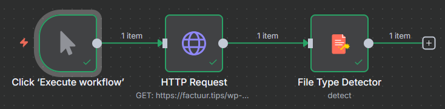

# n8n-nodes-file-type-detector


A powerful n8n community node that detects file types using magic bytes analysis, providing more reliable file type detection than MIME types alone.

## Features

- **Magic Bytes Detection**: Uses the `file-type` library to analyze file headers for accurate type detection
- **MIME Type Fallback**: Falls back to original MIME type when magic bytes detection fails
- **File Categorization**: Automatically categorizes files (image, document, video, audio, archive, etc.)
- **Comprehensive Analysis**: Provides detailed file information including size, confidence level, and detection method
- **Error Handling**: Robust error handling with continue-on-fail support

## Installation

### Via n8n Community Nodes (Recommended)

1. Open your n8n instance
2. Go to **Settings** → **Community Nodes**
3. Click **"Install a community node"**
4. Enter: `n8n-nodes-file-type-detector`
5. Click **Install**

### Via npm (Self-hosted n8n)

```bash
npm install n8n-nodes-file-type-detector
```

After installation, restart your n8n instance to load the new node.

## Usage

### Basic Workflow

The File Type Detector node works with binary data and is typically used in workflows that process files:

```
File Source → File Type Detector → Process Based on Type
```

### Example Workflows

#### 1. Analyze Uploaded Files
```
Webhook (File Upload) → File Type Detector → Switch (by file category)
```

#### 2. Process Email Attachments
```
Email Trigger → File Type Detector → Route by File Type
```

#### 3. Download and Analyze Files
```
HTTP Request (File Download) → File Type Detector → Store with Metadata
```

### Node Configuration

#### Parameters

- **Binary Property** (default: `data`): The name of the binary property containing the file data
- **Fallback to Original MIME Type** (default: `true`): Whether to use the original MIME type if detection fails
- **Include File Categories** (default: `true`): Whether to include categorized file types in the output

### Output Format

The node adds a `fileTypeAnalysis` object to your data with the following structure:

```json
{
  "fileTypeAnalysis": {
    "originalMimeType": "image/png",
    "fileName": "example.png",
    "fileSize": 12345,
    "detectionMethod": "magic-bytes",
    "confident": true,
    "detectedMimeType": "image/png",
    "detectedExtension": "png",
    "typeName": "png",
    "fileCategory": "image"
  }
}
```

#### Field Descriptions

| Field | Description |
|-------|-------------|
| `originalMimeType` | The original MIME type from the source |
| `fileName` | The original filename (if available) |
| `fileSize` | File size in bytes |
| `detectionMethod` | Method used: `"magic-bytes"` or `"fallback"` |
| `confident` | Boolean indicating confidence in detection |
| `detectedMimeType` | The detected MIME type |
| `detectedExtension` | The detected file extension |
| `typeName` | The type name (e.g., "png", "pdf") |
| `fileCategory` | File category (see categories below) |

#### File Categories

The node categorizes files into the following types:

- **image**: PNG, JPEG, GIF, BMP, WebP, SVG, etc.
- **document**: PDF, DOC, DOCX, TXT, RTF, etc.
- **spreadsheet**: XLS, XLSX, CSV, ODS, etc.
- **presentation**: PPT, PPTX, ODP, etc.
- **video**: MP4, AVI, MOV, WMV, etc.
- **audio**: MP3, WAV, FLAC, AAC, etc.
- **archive**: ZIP, RAR, 7Z, TAR, etc.
- **code**: JS, HTML, CSS, Python, etc.
- **other**: Files that don't fit other categories

## Use Cases

### 1. File Upload Validation
Validate that uploaded files match expected types, regardless of file extension manipulation.

### 2. Content Processing Workflows
Route different file types to appropriate processing nodes (OCR for documents, thumbnail generation for images, etc.).

### 3. Security Scanning
Detect potentially malicious files that may have incorrect MIME types or extensions.

### 4. File Organization
Automatically organize files into folders based on their actual type rather than claimed type.

### 5. Data Pipeline Processing
Ensure data pipelines handle files correctly by knowing their true format.

## Why Use Magic Bytes Detection?

Traditional MIME type detection can be unreliable because:

- **File extensions can be changed** by users
- **Web servers may report incorrect MIME types**
- **Email systems may modify MIME types**
- **Malicious files** may claim to be different types

Magic bytes detection analyzes the actual file content to determine the true file type, making it much more reliable for security and processing purposes.

## Examples

### Example 1: Simple File Analysis

**Workflow**: `Manual Trigger → HTTP Request → File Type Detector`



**HTTP Request Configuration**:
- URL: `https://httpbin.org/image/png`
- Response Format: `File`

**Result**: Detects the file as a PNG image with high confidence.

### Example 2: Email Attachment Processing

**Workflow**: `Email Trigger → File Type Detector → IF (by category) → Process Accordingly`

**IF Node Logic**:
- If `fileCategory` equals `"image"` → Send to image processing
- If `fileCategory` equals `"document"` → Send to OCR processing
- Else → Log unknown file type

### Example 3: Security Validation

**Workflow**: `Webhook → File Type Detector → IF (confidence check) → Security Action`

**Security Check**:
```javascript
// In IF node expression
{{ $node["File Type Detector"].json.fileTypeAnalysis.confident === false }}
```

If confidence is low, flag for manual review.

## Development

Want to contribute or modify this node? See [DEVELOPMENT.md](./DEVELOPMENT.md) for local development setup instructions.

## Requirements

- **n8n version**: 1.0.0 or higher
- **Node.js**: 20.19 or higher (for development)

## Dependencies

- `file-type`: For magic bytes file type detection
- `n8n-workflow`: n8n workflow types and interfaces

## License

[MIT](LICENSE.md)

## Support

- **Issues**: Please report issues on [GitHub Issues](https://github.com/yourusername/n8n-nodes-file-type-detector/issues)
- **Documentation**: Full documentation available in the [n8n Community](https://community.n8n.io/)
- **n8n Discord**: Join the [n8n Discord](https://discord.gg/n8n) for community support

## Contributing

Contributions are welcome! Please read our contributing guidelines and submit pull requests to our GitHub repository.

## Changelog

### v0.1.0
- Initial release
- Magic bytes file type detection
- File categorization
- Fallback to original MIME types
- Comprehensive file analysis output

---

**Made with ❤️ for the n8n community**
